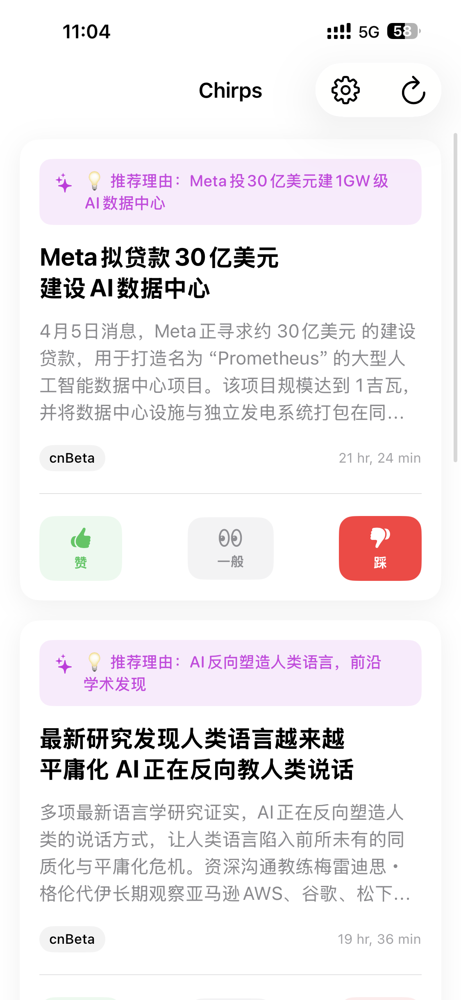
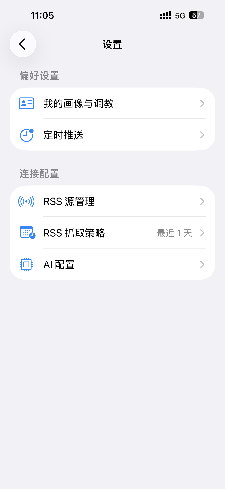
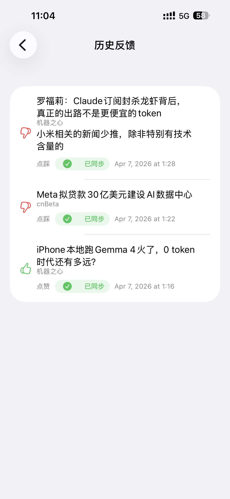

# ChirpAI

一个尝试用大模型直接接管“推荐系统核心决策”的 iOS 原生应用。

`ChirpAI` 不是先打标签、算权重、做向量召回，再把结果拼回给用户，而是把“新闻筛选”“推荐理由生成”“用户画像更新”这三件核心事情直接交给大模型处理。应用基于 `SwiftUI + SwiftData` 构建，当前通过 `RSS + GLM` 的方式生成更像“私人推文管家”的阅读体验。

> If TikTok / Twitter / News Feed 的推荐逻辑不再是一套隐形打分器，而是一个可以被你持续“调教”的语言智能体，会发生什么？

`ChirpAI` 是我对这个问题的一个产品化实验。

## 为什么这个项目值得看

- 它不是“给信息流套一个 AI 总结层”，而是直接把推荐决策交给大模型
- 它把用户画像从标签系统改成了自然语言画像
- 它要求模型不仅选内容，还要解释“为什么是这条”
- 它把反馈闭环做成了可持续迭代的 agentic 流程，而不是一次性 prompt demo

## 预览

截图目录已预留在：

[`docs/images`](./docs/images)

后续需要把真实截图放进去，并取消下面这段注释式占位：

```md
[//]: # ()
[//]: # ()
[//]: # ()
```

## 核心理念

传统信息流推荐系统常见做法是：

- 给内容打标签
- 给用户打标签
- 用规则或算法算一个匹配分

`ChirpAI` 的思路不同：

- 用自然语言维护用户画像
- 用大模型直接理解候选内容
- 用大模型直接决定“这条要不要推”
- 用大模型直接生成“为什么推荐给你”

换句话说，这是一个把推荐系统核心逻辑“语言化”的实验项目。

## 当前能力

- 基于 RSS 拉取候选内容
- 通过大模型两阶段筛选并挑出最值得推荐的一条
- 为每条内容生成个性化推荐理由
- 基于点赞、一般、点踩和文字反馈持续重塑用户画像
- 支持在设置页直接“调教”画像
- 支持多组 AI 配置切换与连通性测试
- 支持 RSS 源增删改查、启停和探测
- 使用 SwiftData 本地存储新闻、反馈、画像和去重记录

## 技术栈

- `SwiftUI`
- `SwiftData`
- `Combine`
- `RSS`
- `GLM Function Calling`

## 快速开始

### 1. 克隆项目

```bash
git clone https://github.com/dolibali/openchirp.git
cd openchirp
```

### 2. 打开工程

打开：

[`ChirpAI.xcodeproj`](./ChirpAI.xcodeproj)

### 3. 配置签名

如果你要在真机运行，需要在 Xcode 中配置你自己的签名信息：

1. 选中 `ChirpAI` target
2. 打开 `Signing & Capabilities`
3. 勾选 `Automatically manage signing`
4. 选择你自己的 Apple Developer Team
5. 把 `Bundle Identifier` 改成你自己的唯一值，例如 `com.yourname.ChirpAI`

如果你只是想先体验功能，直接选择 `iPhone Simulator` 运行即可。

### 4. 首次启动后配置 AI

App 不在仓库里硬编码 API Key。首次运行后请在应用内完成配置：

1. 进入 `设置`
2. 打开 `AI 配置`
3. 新建或编辑一个配置
4. 填入：
   - `API Key`
   - `Base URL`
   - `模型名称`
5. 点击“测试连通性”

当前默认值面向智谱 GLM：

- Base URL: `https://open.bigmodel.cn/api/coding/paas/v4`
- Model: `GLM-4.7-FlashX`

### 5. 配置 RSS 源

应用内置 RSS 源清单位于：

[`ChirpAI/Resources/rss_sources.json`](./ChirpAI/Resources/rss_sources.json)

你也可以在应用内的 `RSS 源管理` 页面：

- 开启或关闭源
- 新增源
- 编辑源
- 删除源
- 测试连通性

## 使用流程

1. 首次进入应用后完成 onboarding，告诉系统你的兴趣方向和额外偏好。
2. 在首页点击“获取推文”，系统会抓取 RSS 候选内容。
3. 大模型会结合你的画像与近期已看记录完成筛选。
4. 应用只保留最值得推荐的内容，并生成推荐理由。
5. 你可以点赞、一般、点踩，或者输入更具体的文字反馈。
6. 用户画像会随着反馈持续迭代。

## 项目结构

```text
openchirp/
├── ChirpAI.xcodeproj
├── ChirpAI
│   ├── Models
│   ├── Services
│   ├── Utils
│   ├── ViewModels
│   ├── Views
│   ├── Resources
│   └── Assets.xcassets
└── Architecture.md
```

主要目录说明：

- `Models`: SwiftData 数据模型与 AI 配置模型
- `Services`: RSS 拉取、解析、偏好管理、GLM 调用和 System Prompt
- `ViewModels`: Feed、设置、详情等页面状态管理
- `Views`: 首页、详情页、设置页、日志面板、AI 配置等界面
- `Resources`: RSS 源配置等资源文件

## 架构说明

更完整的架构设计见：

[`Architecture.md`](./Architecture.md)

当前主流程是：

1. `NewsFetcher` 拉取并解析启用的 RSS 源
2. 用 `SeenNews` 做去重
3. 将候选内容和自然语言用户画像交给 `GLMService`
4. 通过 Function Calling 返回候选索引和推荐理由
5. 用户行为再反向驱动画像更新

## 数据与隐私

- 新闻、反馈、用户画像等数据存储在本地 SwiftData
- AI 配置当前保存在本地 `UserDefaults`
- API Key 不会随仓库一起提交

注意：当前 AI 配置仍属于原型阶段实现，更适合个人开发和实验，不建议直接按现状用于高安全要求场景。

## 当前限制

- 当前更偏向原型验证，而不是生产级推荐系统
- 真机运行需要你自己的签名和可用的 Bundle Identifier
- AI 配置目前保存在本地，没有接入 Keychain
- 推荐质量强依赖 RSS 源质量、Prompt 设计和模型表现

## Roadmap

- 使用 Keychain 保存敏感配置
- 增强多轮画像演化与解释能力
- 优化推荐稳定性与多样性控制
- 增加更强的日志可视化和调试能力
- 支持更多模型服务商

## 致谢

这是一个围绕“Agentic LLM 能否直接承担推荐系统核心逻辑”展开的个人实验项目。

如果你也对“用自然语言替代传统推荐中间层”感兴趣，欢迎交流。
